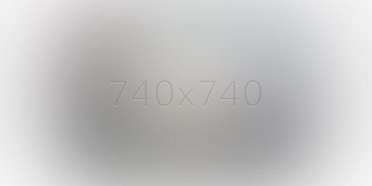

# v 0.8.4.
## CONTENT UPDATE NOTES
---
### Setup (Mac)
If you are only updating HTML & JS, and you are not a web derp, follow the process below:

**Fetching Code (Only Need to Run This ONCE)**
1. Using terminal window, browse to directory you wish to store the code
2. Run `git clone https://github.com/shan-du/dx-portfolio.git`

**Making Updates**
1. Make your updates as needed
2. Once done, Using terminal window, go to the code directory: `cd /CODE_DIRECTORY`
3. run `git status`
4. Make sure the files shown in red are intended
5. If files show up which you did NOT modify, run `git checkout FILENAME`
6. Otherwise, run `git commit -am "DESCRIPTION OF YOUR CHANGES"`
7. Run `git push origin master`
8. Enter your GitHub credentials

**Sync Code onto Server**
1. In terminal window, run `ssh awesomedels@samuel-chase.dreamhost.com`
2. Enter `yes` if it's asking to establish fingerprint
3. Enter password
4. Run `cd deliaxiong.com`
5. Run `git pull origin master`
6. Profit $$$

### Update Particle Config File
Simply replace this file `/js/particlesjs-config.json`
### Update CSS
* Color Accent: `/less/royal-purple.less` 
* Common Colors/Styles: `/less/variables.less`

**NOTE:** highly suggest generate CSS with LESS compiler, instruction in Dev Notes towards bottom, enter at own risk

### HTML
#### Navigation
The `href` values here match to the ID of the portfolio sections below wrapped in `<section>` tags
```
<nav class="col-xs-12 col-lg-2 col-lg-offset-8">
	<ul id="side-nav">
		<li><a href="#section1">about</a></li>
		<li><a href="#section2">experience</a></li>
		<li><a href="#section3">education</a></li>
		<li><a href="#section4">let's chat</a></li>
		<li><a id="top" href="#">top</a></li>
	</ul>
</nav>
```
### Experiences
Captured in `<section id="section2">` tag

### Projects
Follows after each experience section.
Project gallery contains code like this:
```
<ul class="folio-list" data-img-aspect-ratio="2">
	<!-- Project 1 -->
	<li class="col-xs-10 col-xs-offset-1 col-sm-5 col-sm-offset-1 col-lg-5 col-lg-offset-1">
		<a class="lightbox" href="images/portfolio/project5.jpg">
			<div class="atvImg">
				

				<div class="atvImg-layer" data-img="images/portfolio/project5.jpg"></div>
			</div>
		</a>
	</li>

	<!-- Project 2 -->
	<li class="col-xs-10 col-xs-offset-1 col-sm-5 col-sm-offset-0 col-lg-5">
		<a class="lightbox" href="images/portfolio/project5.jpg">
			<div class="atvImg">
				

				<div class="atvImg-layer" data-img="images/portfolio/project5.jpg"></div>
			</div>
		</a>
	</li>
</ul>
```
Each project image *width:height* ratio can be defined in the `<ul>` tag with this attribute `data-img-aspect-ratio="2"`

*i.e. value 2 means WxH = 2x1, 1 means WxH = 1x1, etc.*

Recommended size for ratio 2: **740x370**

### Education
Captured in `<section id="section3">` tag.

Education follows very similar patterns as Experiences section minus the project galleries

### Everything Else
The HTML markups are fairly straight forward, and there are sufficient inline comments that serve as idiots' guide.

---
---
## DEV NOTES
### Install NodeJS
https://nodejs.org/en/
### Fetch code from GIT (In console or Git Bash)
`git clone https://github.com/shan-du/dx-portfolio.git`
### Install npm Packages & Dependencies
This includes all required dev packages such as Grunt, LESS, Watch, etc.
```
> npm install
> npm install matchdep
> npm install -g grunt-cli
```

### Start Local Dev
```
// Only watch for file changes
> grunt watch

// Only compile LESS
> grunt less

// Start local f/e server
> grunt server
```
